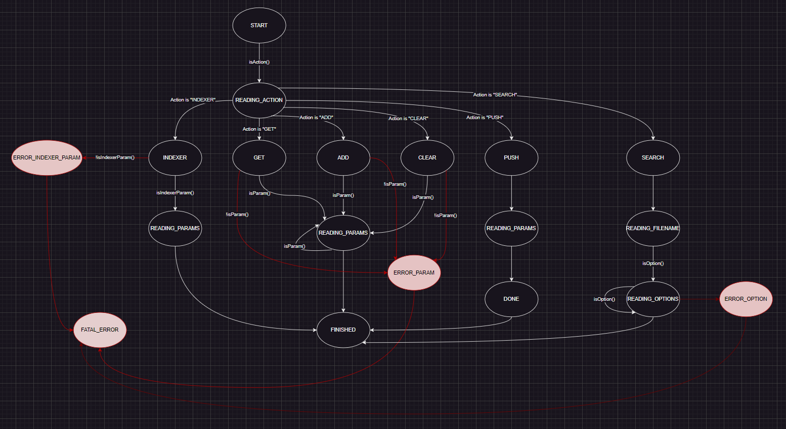

# TP-1-Qt-Dev-desktop

Certainement par soucis de manque d'organisation, nous n'avons pas pu sortir un projet fonctionnel à 100%. Voici donc l'état actuel du projet.

----
### Sur la branche `bdd` nous avons la base de données et l'indexer.

Au niveau de la BDD j'ai utiliser QtSql et j'ai fait plusieurs fonctions :

- `searchData`
- `insertData`
- `createTable`
- et deux autres fonctions

En outre, j'ai ajouté les fonctions `bdd:open` et `bdd:close` pour ouvrir et fermer la connexion à la base de données.

elles sont deja integrée dans `searchData` et `insertData`.
**insertData**: 

    void BDD::insertData(QList<QVariantList> data)
    {
        qDebug() << "Inserting data into database";
        if (!db.isOpen()) {
            if (!open()) {
            qWarning() << "Cannot open database:" << db.lastError().text();
        return;
    }
        createTable();
    }   QSqlQuery query(db);
        query.prepare("INSERT INTO files (path, filename, extension, size) VALUES (:path, :filename, :extension, :size)");
    
    for (const auto& rowData : data) {
        query.bindValue(":path", rowData.at(0).toString());
        query.bindValue(":filename", rowData.at(1).toString());
        query.bindValue(":extension", rowData.at(2).toString());
        query.bindValue(":size", rowData.at(3).toLongLong());
    
        if (!query.exec()) {
            qWarning() << "Failed to insert data:" << query.lastError().text();
        }
    }
        QThread::usleep(500);
        db.close();
    
        qDebug() << "Data inserted into database";
    }

**searchData**:

    QList<QList<QVariant>> BDD::searchData(const QString& searchString) {
        qDebug() << "Searching database for" << searchString;
        QList<QList<QVariant>> result;
        QSqlQuery query(db);
        query.prepare("SELECT path, filename, extension, size FROM files WHERE path LIKE :search OR filename LIKE :search OR extension LIKE :search");
        query.bindValue(":search", "%" + searchString + "%");
    
    if (!query.exec()) {
        qDebug() << "Error executing search query: " << query.lastError().text();
        return result;
    }
    
    while (query.next()) {
        QList<QVariant> row;
        row.append(query.value("path"));
        row.append(query.value("filename"));
        row.append(query.value("extension"));
        row.append(query.value("size"));
        result.append(row);
    }
        qDebug() << "Search finished with" << result.size() << "results";
        return result;
    }

et j'utilise ces fonction dans l'indexer ici :

    void indexer::run(){
        QDirIterator it(m_start_path, QDirIterator::Subdirectories);
        QRegularExpression re("^(.*)/([^/]+)\\.([^.]+)$");
    
        BDD bdd;
    
        QList<QVariantList> buffer;
        const int bufferSize = 400;
    
        while (it.hasNext()) {
            QString nextPath = it.next();
            QRegularExpressionMatch match = re.match(nextPath);
            QFile file(nextPath);
    
            if (match.hasMatch()) {
                QString path = match.captured(1);
                QString fileName = match.captured(2);
                QString extension = match.captured(3);
    
                // Vérifie si l'extension du fichier est différente de "dll"
                if (extension.toLower() != "dll") {
                    if (file.open(QIODevice::ReadOnly)) {
                        // Récupère la taille du fichier en octets
                        qint64 size = file.size();
    
                        // Ajoute les informations du fichier au buffer
                        QVariantList rowData;
                        rowData.append(path);
                        rowData.append(fileName);
                        rowData.append(extension);
                        rowData.append(size);
                        buffer.append(rowData);
    
                        // Ferme le fichier
                        file.close();
                    }
                }
            }
    
            // Vérifie si le buffer est plein
            if (buffer.size() == bufferSize) {
                qDebug() << "Buffer full, inserting data into database...";
                // Insère les données du buffer dans la base de données
                bdd.insertData(buffer);
    
                // Vide le buffer
                buffer.clear();
            }
    
            QThread::usleep(100);
        }
    
        // Insère les données restantes du buffer dans la base de données
        if (!buffer.isEmpty()) {
            qDebug() << "Inserting remaining data into database...";
            bdd.insertData(buffer);
        }
        qDebug() << "Indexing complete";
    }

et sur le bouton recherche ici : 

    void MainWindow::on_btnSearch_clicked()
    {
        QString searchString = ui->txtSearch->toPlainText();
        _bdd.open();
        // Recherche des données correspondantes dans la base de donnees
        QList<QList<QVariant>> searchDataList = _bdd.searchData(searchString);
    
        // Création d'un modele de données pour la vue
        QStandardItemModel *model = new QStandardItemModel(searchDataList.size(), 4, this);
        model->setHeaderData(0, Qt::Horizontal, "Path");
        model->setHeaderData(1, Qt::Horizontal, "File Name");
        model->setHeaderData(2, Qt::Horizontal, "Extension");
        model->setHeaderData(3, Qt::Horizontal, "Size");
    
        // Remplissage du modele avec les données de la base de données
        for (int row = 0; row < searchDataList.size(); ++row) {
            for (int col = 0; col < searchDataList[row].size(); ++col) {
                QStandardItem *item = new QStandardItem(searchDataList[row][col].toString());
                model->setItem(row, col, item);
            }
        }
    
        // Affichage du modèle dans la vue
        ui->tableView->setModel(model);
        _bdd.close();
    }
j'ai aussi essayer de mettre en place la bdd sur serveur :
voici le fichier serveur.cpp :

    #include "server.h"
    
    #include <QTcpSocket>
    #include "indexingclient.h"
    
    void Server::start(int port) {
        if (!listen(QHostAddress::Any, port)) {
            qWarning() << "Unable to start server: " << errorString();
        } else {
            qDebug() << "Server started on port " << port;
        }
    }
    
    void Server::incomingConnection(qintptr handle) {
        IndexingClient* client = new IndexingClient(this);
        QTcpSocket* socket = new QTcpSocket(client);
        socket->setSocketDescriptor(handle);
        client->setSocket(socket);
        qDebug() << "New client connected";
    }


j'ai mis dans le main pour démarrer le serveur sur le port 7007 : 

    int main(int argc, char *argv[])
    {
        QApplication a(argc, argv);
    
        Server server;
        server.start(7007);
    
        MainWindow w;
        w.show();
    
        return a.exec();
    }

et j'ai fait une tentative de FSM : 

        void IndexingClient::onDataReceived()
        {
            QByteArray data = m_socket->readAll();
            QDataStream dataStream(&data, QIODevice::ReadOnly);
            QString messageType;
            dataStream >> messageType;
        
            if (messageType == "SEARCH_RESULT") {
                QList<QList<QVariant>> result;
                dataStream >> result;
                emit searchResultReceived(result); // Emit signal to notify the client
            }
        }
    void IndexingClient::sendIndexerState(const QString& state) {
        QByteArray block;
        QDataStream out(&block, QIODevice::WriteOnly);
        out.setVersion(QDataStream::Qt_5_15);
    
        out << quint16(0) << QString("INDEXER") << state;
        out.device()->seek(0);
        out << quint16(block.size() - sizeof(quint16));
    
        m_socket->write(block);
    }
    
    void IndexingClient::sendGetRequest(const QString& request) {
        QByteArray block;
        QDataStream out(&block, QIODevice::WriteOnly);
        out.setVersion(QDataStream::Qt_5_15);
    
        out << quint16(0) << QString("GET") << request;
        out.device()->seek(0);
        out << quint16(block.size() - sizeof(quint16));
    
        m_socket->write(block);
    }
    
    void IndexingClient::sendAddRequest(const QString& request, const QStringList& args) {
        QByteArray block;
        QDataStream out(&block, QIODevice::WriteOnly);
        out.setVersion(QDataStream::Qt_5_15);
    
        out << quint16(0) << QString("ADD") << request << args;
        out.device()->seek(0);
        out << quint16(block.size() - sizeof(quint16));
    
        m_socket->write(block);
    }
    
    void IndexingClient::sendPushRequest(const QString& request, const QStringList& args) {
        QByteArray block;
        QDataStream out(&block, QIODevice::WriteOnly);
        out.setVersion(QDataStream::Qt_5_15);
    
        out << quint16(0) << QString("PUSH") << request << args << QString("DONE");
        out.device()->seek(0);
        out << quint16(block.size() - sizeof(quint16));
    
        m_socket->write(block);
    }
    
    void IndexingClient::sendClearRequest(const QString& request) {
        QByteArray block;
        QDataStream out(&block, QIODevice::WriteOnly);
        out.setVersion(QDataStream::Qt_5_15);
    
        out << quint16(0) << QString("CLEAR") << request;
        out.device()->seek(0);
        out << quint16(block.size() - sizeof(quint16));
    
        m_socket->write(block);
    }
    
    void IndexingClient::sendSearchRequest(const QString& searchString, const QString& lastModified,
                                const QString& created, const QString& maxSize, const QString& minSize,
                                const QString& sizeRange, const QString& extensions, const QString& types) {
        if (!m_socket || m_socket->state() != QTcpSocket::ConnectedState) {
            emit errorOccurred("Client is not connected to server.");
            return;
        }
    
        QString requestString = QString("SEARCH %1 %2 %3 %4 %5 %6 %7 %8\r\n")
                .arg(searchString)
                .arg(lastModified)
                .arg(created)
                .arg(maxSize)
                .arg(minSize)
                .arg(sizeRange)
                .arg(extensions)
                .arg(types);
    
        qDebug() << "Sending search request to server:" << requestString.trimmed();
    
        m_socket->write(requestString.toUtf8());
    }
   

L'**indexer** est capable de lire les fichiers sur un disque, grâce à une regex de dissocier certaines informations contenu dans tout les "path" que l'on récupère.

L'**indexeur** va ensuite récupérer des informations sur le fichiers comme sa date de création, ***(expliques ici le buffer que t'as fais)***

----
### Sur la branche `fsm` nous avons donc le **lexer** et la **FSM**.
L'objectif initial de la **FSM** est de construire une requête SQL à ensuite envoyer à la base de données et suivre tout le processus. 


L' **UI** va dialoguer avec la **FSM** en lui passant la requête (requête utilisant le dialecte). 

Ensuite la **FSM** à l'aide du **Lexer** va check toutes les parties de notre requête "token par token" en suivant les étapes et en checkant bien les transitions possibles entre chaque états, et cela grâce à la classe **State**.

Et grâce à la callback de chaque `checkState()` on va monter notre requête **SQL** qui sera transmise à notre base de donnée pour remonter les résultats à l' **UI**.

Toutes les étapes de la FSM ne sont pas faite, mais le SEARCH fonctionne. Il y manque quelques précisions d'options comme les "BETWEEN".

> le code de la FSM devrait run sans erreurs.
> 
Exemple de requête à tester:
```
SEARCH 'testme please' CREATED:12/2020 MAX_SIZE:10M MIN_SIZE:20M TYPE:image OR text LAST_MODIFIED:05/07/2023
```

----
### Documents supplémentaires

Le schéma assez simple reprennant les éléments du projet


Le diagramme état transition

